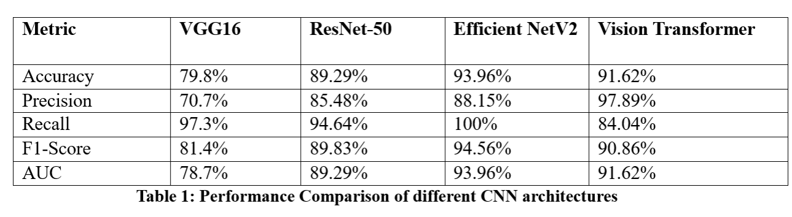

 # NoSmokeZone: AI on the Hunt for Smokers

## Backstory

So, here’s how **NoSmokeZone** came about. There used to be a spot right in front of our campus where a bunch of students would hang out, and it turned into a bit of a smoke pit. I mean, we’re talking large crowds gathered, all puffing away, which eventually caught the attention of the police. They started sending complaints, and it became clear that this wasn’t just a funny student quirk anymore—it was a public health issue.

Despite the warnings, students kept returning to that spot. This inspired us to create a tool that could monitor smoking behaviors—not just to identify smokers but also to provide valuable data to the campus administration. With this model, we aimed to collect insights on smoking patterns—like who, when, and where most students tend to smoke—helping the administration make informed decisions.

Now, sure, this could be solved with a CCTV camera, but that would require continuous monitoring and human intervention. Instead, using AI allows us to automate the process. Our model can analyze video feeds and send real-time clips of those moments when someone is smoking. This way, the campus administration can take timely action without needing to constantly watch the footage themselves.

It was a large project involving both software and hardware. My role was focused on the software side, where I was responsible for training and selecting an efficient model for detection. The complete project code is uploaded to the lab's private GitHub repository.

## Methodology

- **Data Collection**: The dataset comprises 1,120 images, evenly divided into two classes: 560 images of smokers and 560 images of non-smokers. All images are resized to a resolution of 250x250 pixels.  
  Dataset: [Khan, Ali (2022), “Smoker Detection Dataset”, Mendeley Data, V1, doi: 10.17632/j45dj8bgfc.1](https://data.mendeley.com/datasets/j45dj8bgfc/1)

- **Data Preparation**: Includes image resizing, normalization, label encoding, and data augmentation.

- **Modeling**: We explored various architectures, including VGG16, ResNet-50, MobileNetV2, EfficientNetV2, and Vision Transformer (ViT).

- **Model Comparison**: Conducted a comprehensive analysis of model performance and trade-offs.

## Comparative Analysis

The results indicate that EfficientNetV2 is the most effective architecture for smoker detection. Its superior performance can be attributed to its advanced design, which balances model depth, width, and resolution more effectively than ResNet-50 and ViT. Get the full report [here](Docs/Report.pdf).

In summary, this project demonstrates the effectiveness of advanced CNN architectures for smoker detection, with EfficientNetV2 emerging as the most capable model. By addressing identified areas for further research and development, we can continue to enhance the accuracy, efficiency, and ethical applications of deep learning in public health and beyond.
